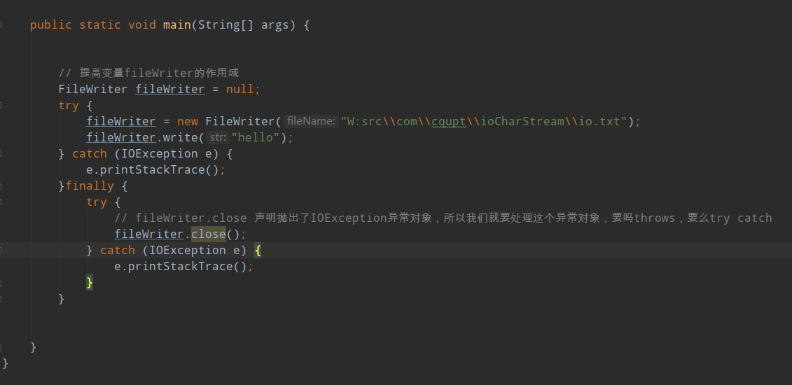
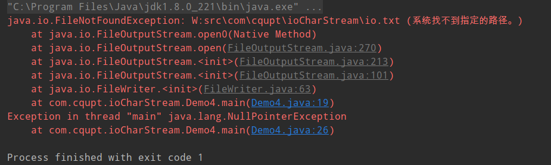

# io字符流
  
  
jkd7的新特性：
    在try的后面可以增加一个（），在括号中定义流对象，那么这个流对象就在try中有效try中的代码执行完毕，会自动释放流对象，不用写finally  
jdk9中的新特性：  
   try的前边可以定义流对象，在try后边的（）直接引入流对象的名称（变量名），在try代码执行完毕之后，流对象也可以释放掉，不用写finally  
       