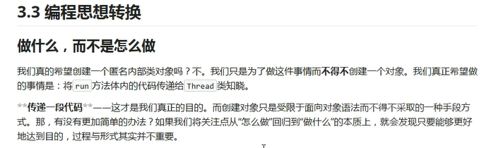

## lambda表达式 在jdk1.8中加入的

Lambda表达式标准格式：   
1.一些参数  
2.一个箭头  
3.一段代码  
格式：  
（参数列表）->{一些重写的代码}  
（）：接口中抽象方法的参数列表，没有参数，就空着；有参数就写出参数，多个参数用逗号隔开   
->：传递的意思，把参数传递给方法体
{}：重写接口的抽象方法的方法体   
### lambda:可推导，可省略：
凡是可以通过上下文推导出来的内容，都可以省略书写  
可以省略的内容：  
1.（参数列表）：括号中参数列表的数据类型，可以省略不写  
2.（参数列表）：括号中的参数如果只有一个，那么类型和（）都可以省略  
3.{一些代码}：如果{}中的代码只有一个行，无论是否有返回值，都可以省略（{}，return,分好，但是必须一起省略）  

jdk1.7之前创建集合必须把前后的泛型都写上，但是1.7之后，等号后边的泛型可以省略，后边的泛型是可以根据起前边的泛型推导出来     
### 使用lambda的前提：
1.使用lambda表达式必须具有接口，且要求接口中有且仅有一个抽象方法  
2.使用lambda必须具有上下文推导  
备注：有且仅有一个抽象方法的接口，称为函数式接口  