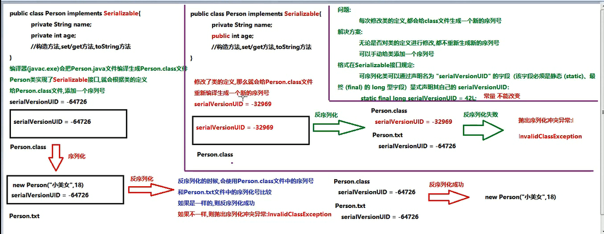

# 序列化笔记
Serializable 接口也叫作标记型接口  
要进行序列化和反序列化的类必须实现Serializable接口，就会给类添加一个标记  

**transient**关键字：瞬态关键字  
被transient修饰的成员变量是不可以被序列化的，当我们不想让一个成员变量序列化同时不变成静态的时候就可以使用transient关键字来修饰  

**static**关键字：静态关键字  
静态优先于非静态加载到内存中（静态优先于对象进入到内存中）  
别static修饰的成员变量是不可以被序列化的，序列化的都是对象   
  
  
