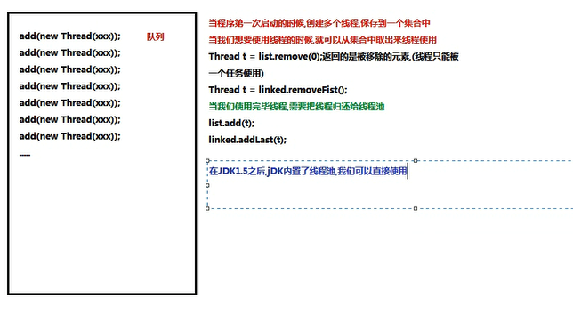
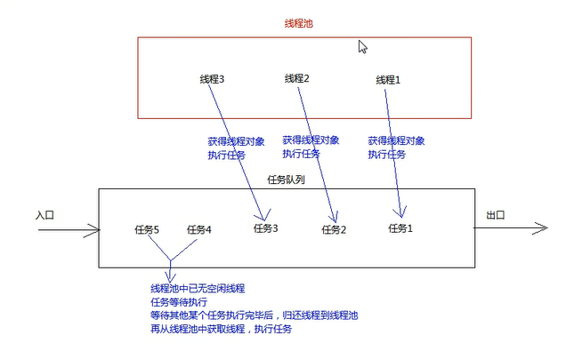
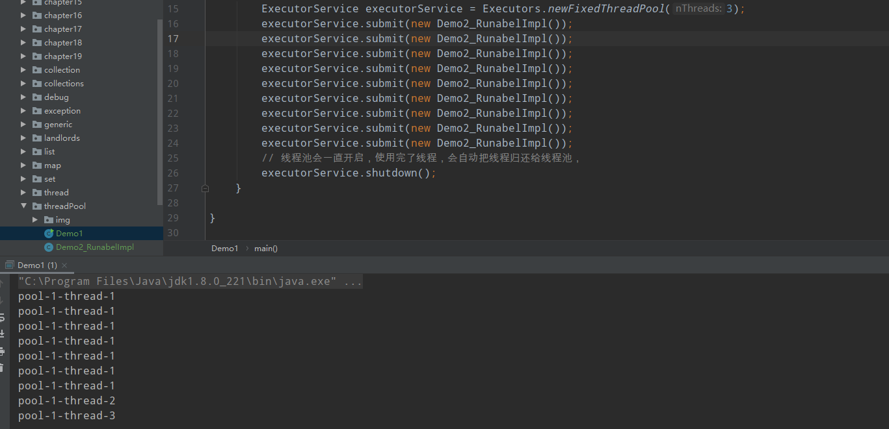
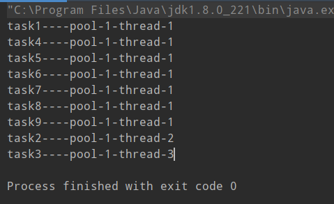

## 线程池
为什么要使用线程池？  
当并发的线程数量很多，并且每个线程都执行一个时间很短的任务就结束了了，这样频繁的创建吸线程会大大降低系统的效率  
因为频繁的创建和销毁线程会需要大量的时间  
线程池：其实就是一个容纳多个线程的容器，其中的线程可以重复使用，省去了频繁创建线程对象的操作，无需反复创建线程而消耗过多的资源  
### 线程池底层原理 容器（ArrayList，HashSet，LinkedList,HashMap） 
  
线程池运行原理：
  
### 线程池的使用步骤：
1.使用线程池的工厂类Executors里面提供的静态方法newFixedThreadPool生产一个指定的线程数量的线程池  
2.创建一个类，实现Runable接口，重写run方法，设置线程任务  
3.调用ExecutorService中的方法submit，传递线程任务（实现类），开启线程，执行run方法  
4.调用ExecutorService中的方法shutdown销毁线程池（不建议执行）  
### 结果分析
   
为什么前面几个都是thread1创建的？  
  
可见确实挺高了开启线程任务的速度