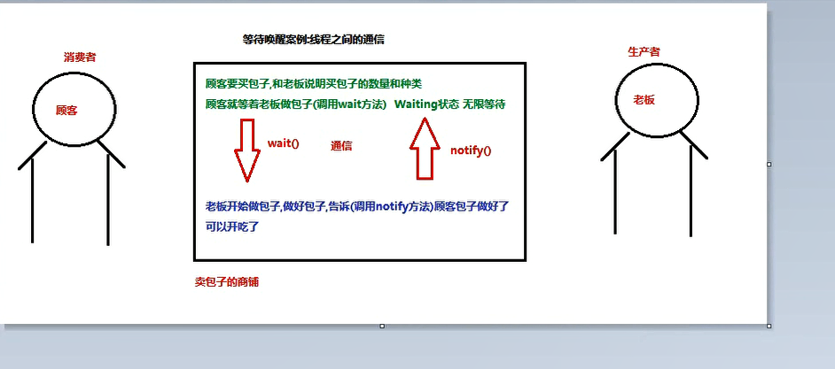

## 进程状态

## 线程间通信
概念：多个线程在处理同一个资源，但是处理的动作不同.  
线程A:生成者，
线程B:消费者，

为甚么要处理线程之间的通信？  
多个线程并发执行是，在默认的情况下cpu是随机切换线程的，当我们需要多个线程来完成同一个任务，   

## 1.等待唤醒机制（线程之间的通信）
重点：有效的利用资源（生产一个包子，吃一个包子。。。）  
通信：对包子的状态进行判断  
----1.没有包子：消费者线程唤醒生产者线程，-》生产者线程生成，修改包子状态  
----2.有包子：生产者线程唤醒消费者线程，自己等待-》消费者开始消费，修改该包子状态为没有  
wait（）  
notify（）  

注意：  
1.wait方法和notify方法必须要由同一个锁对象来调用，对应的锁对象可以通过notify唤醒使用同一个锁对象调用的wait方法后的线程  
2.wait方法与notify是Object类中的一个方法，所有的类都继承与object类，所有都可以使用  
3.wait和notify方法必要要在同步代码块或者是同步函数中使用，因为：必须要通过锁对象调用者两个方法  
  
分析：  
包子类：成员属性（皮，馅，包子状态boolean）  
消费者类：设置线程任务（对包子状态判断，true，吃包子，修改包子状态，唤醒生产者进程；false，wait，进程等待状态）   
生产者类：（是一个线程类可以继承Thread），设置线程任务（生产包子，对包子的状态进行判断，true：有包子，调用waite进入等待；false：生产包子，交替生产两种博包子，有两种状态，生产者生产好了，要修改该包子状态，true，唤醒消费者线程）  
测试类：程序执行的入口，启动程序   
-------创建main方法，创建生产者消费者线程，包子类对象