# 数据库相关笔记
DataBase（DB）  
数据库特点：  
1.持久化的  
2.使用了统一的方式来操作数据库  
### 常见的数据库软件  
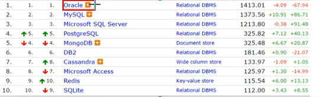  
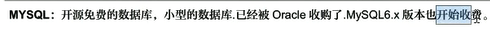  
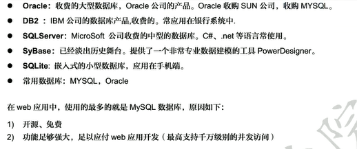  
## Mysql配置
mysql服务   
启动：net start mysql  
关闭：net stop mysql  
## Mysql目录
* 安装目录：   
* 数据目录：  
## 什么是SQL（Structured Query Language）结构化查询语言  
其实就是定义了操作所有关系型数据库的规则    
----
## SQL通用语法  
### 注释
* 单行注释  -- 注释内容或者 # 注释内容
* 多行注释 /\*注释内容\*/  
----  
### 操作数据库 CRUD  
#### 1.Create:创建  
* 创建数据库： `create database 数据库名称；` 
* 创建数据库，判断不存在再创建： `create database if not exists 数据库名称；`  
* 创建数据库，指定字符集  `create database 数据库名称 character set 字符集名；`
#### 2.Retrieve 查询
* 查询所有数据库的名称  `show databases;`  
* 查询某个数据库的字符集；查询某个数据库的语句  `show createdatabase 数据库名称；`
#### 3.update 修改
* 修改数据的字符集： `alter database 数据库名称 character set 字符集名称；`
#### 4.delete 删除
* 删除数据库： `drop database 数据库名称；`
#### 5.使用数据库
* 查询当前的正在使用的数据库名称： `select database();`
* 使用数据库 `use 数据库名称;`
----
### 操作数据库中的表 DDL
#### 1.Create 创建数据表
* 1.语法： `create table 表名（列名1 数据类型1，列名2, 数据类型2 ）；`

##### sql里面的数据类型  
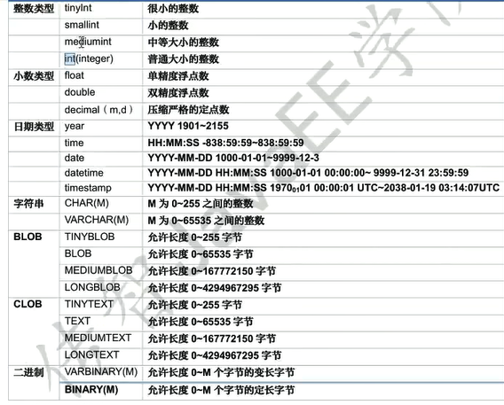   

* 数据类型   
* data类型 只包含年月日的 yyyy-MM-dd
* datatime 包含年月日时分秒 yyyy-MM-dd HH:mm:ss   
* timestamp 时间戳类型 包含年月日时分秒  yyyy-MM-dd HH:mm:ss 
如果不给这个字段赋值，或者赋值为null，则默认使用当前系统时间来自动赋值     
* varchar 字符串类型 `name varchar(20);`表示姓名最大20个字符

```sql
create tabele student(
    id int,
    name varchar(32),
    age int,
    score double(4,1),
    birthday date,
    insertTime timestamp
);
```

* 复制一个表格   
```sql
create table 新表名 like 原表名;
```

#### 2.Retrieve 查询表格
* 查询某个数据库中的所有表名称   
    * show tables;
* 查询表结构  
    * desc 表名；
    
#### 3.update  更新修改数据表
* 修改表的名称     
    `alter table 表名 rename to 新的表名；`
* 修改表的字符集  
    * 查看表的字符集  `show create table 表名；`
    * 修改字符集 `alter table 表名 character set 字符集名称；`  
    `utf8 gbk`
* 添加一列
    `alter table 表名 add 列名 数据类型；`
* 修改列的名称，类型
    `alter table 表名 change 列名 新列名 新数据类型；`   
    `alter table 表名 modify 列名 新的数据类型；`
* 删除列   
    `alter table 表名 drop 列名；`
    
#### 4.delete 删除数据表
* drop table 表名；
* drop table if exits 表名；
----
### DML;增删修改表中的数据
#### 1.添加数据  
* 语法
   * insert INTO 表名（列名1，列明2，列名3）VALUES（值1，值2，值3）；   
   **注意：**   
        * 1.列名和值要一一对应，
        * 2.如果列名不写，默认给所有的数据列名添加数据   
        
   * 
#### 2. 删除数据
   *  ` delete from 表名 [where 条件]；`    
   **注意：**   
        * 如果不写条件，会把表中的数据全部删除    
        * 如果要删除所有记录，
            * 1.delete from 表名； 不推荐，有多少条记录就会执行多少次操作，效率低下
            * truncate table 表名； 先删除表，然后再创建一个同名的表。推荐使用，效率更高            
   * 删除表中的所有数据：
        * truncate table stu； 先删除表，然后创建一个同名的表 
       
#### 3. 修改数据
 * 语法   
 update 表名 set 列名1 = 值1，列名2 = 值2 。。。；   
 `update 表名 set 列名1 = 值1 [where 条件]；`    
**注意**：  
* 如果不加任意条件，则会将表中的所有数据都修改   
* 
----
 
### DQL：查询表中的记录
* ` select * from 表名；`    
  
1.语法   
select   字段列表  
 from 表名列表  
 where 条件列表
 group by 分组字段  
 having 分组之后的条件   
 order by 排序  
 limit 分页限定；
 
2.基础查询  
   * 1.多个字段的查询  select 字段1，字段2，字段3 。。。 from 表名；
   * 2.去除重复的字符  distinct
   * 3.计算列 `一般可以使用四则运算来计算列的值，ifnull（列名，0）可以将null变为0，否则为原值 `     
   * 4.起别名 as，也是可以省略    

```sql
SHOW DATABASES;
USE bevishe;
SHOW TABLES;
SELECT * FROM student;
SELECT newName FROM student;

-- 去除重复的结果 
SELECT DISTINCT newName FROM student;

DESC student;

-- 插入数据
INSERT INTO student() VALUES(1026,"mark",23,120,"1994-03-23",NULL),(1027,"mary",23,121,"1994-02-23",NULL),(1028,"lili",22,110,"1995-07-21",NULL);

SELECT * FROM student WHERE insertTime="2020-01-14 15:19:21";

-- 添加新的列到已有的数据表中去 
ALTER TABLE student ADD(english INT,math INT,chinese INT);

UPDATE student SET english=85,math=100,chinese=10 WHERE id=1024;

-- 
SELECT newName,math+english+IFNULL(chinese,0) AS 总分 FROM student;
```

3.条件查询   
* 1.where字句后面跟条件   
* 2.运算符  
    * > < = <= >= <>
    * between and  
    * in
    * like
    * and && or || not !  
----  
  
## 范式概述 
范式：设计数据库时，需要遵循的一些规范   
目前数据库共有6中范式： 第一范式1NF，第二范式2NF，第三范式3NF，巴斯科德范式BCNF，第四范式4NF，第五范式5NF（完美范式）    
### 分类： 
* 1.第一范式：每一列都是不可分割的原子数据项  
* 2.第二范式：在1NF的基础上，非码属性必须完全依赖于候选码
* 3.第三范式：在2NF的基础上，任何非主属性不依赖于其他非主属性  


----  
## 约束 
* 概念： 对表中的数据进行限定，保证数据的正确性，有效性和完整性。  
**分类：**   
    * 主键约束： primary key    
        * ```sql
            1.含义:非空且唯一,一张表只能有一个字段为主键,主键是表中记录的唯一标识  
          
            2.在创建表时,创建主键约束   
            create table stu(
              id int primary key,
              name varchar (12) unique 
              );
          
            2.删除主键 
             alter table stu modify id int; 这样是没用的   
              
             正确:  
              alter table  stu drop primary key;  因为一个表中的主键只有唯一一个不用指定列号名 
          
            3.在创建完表之后,添加主键   
            alter table stu modify id int primary key;
          
            4.自动增长,如果某一列是自动增长的,使用auto_increment 可以自动完成增长   
              
            5.在创建表的时候添加主键,同时使用自动增长    
            create table stu(
                  id int primary key auto_increment,
                  phone_number varchar (12)
              );
            6.删除自动增长  
            alter table stu modify id int;  主键这样是删不掉的,不会删除掉primary key
          
            7.添加自动增长 
            alter table stu modify id int auto_increment;
          ``` 
    * 非空约束：not null  
        * ```sql
            1.创建表时添加约束 
            create table stu(
                  id int,
                  name varchar(12) not null    # name 非空
              );
          
            2.删除name的非空约束 
            alter table stu modify name varchar(12);
          
          ```
    * 唯一约束：unique   
    注意： mysql中，唯一约束限定的列的值可以有多个null  
        * ```sql
            1.创建表时添加唯一约束  
          create table st(
              id int,
              phone_number varchar(12) unique 
           
          );
            2.删除唯一的约束  
          alter table stu drop index phone_number;
          
            3.添加唯一约束   
          alter table stu modify phone_number varchar(12) unique;
          ``` 
    * 外键约束：foreign key   
        * ```sql
            1.在创建表时,可以添加外键   
            create table 表名(
                  ... 
                  外键列 
                  constraint 外键名称 foreign key (外键列名称) references 主表名称(主表列的名称)
              );
            
            2.删除外键 
            alter talbe 表名 drop foreign key 外键名称;
            3.创建表之后,添加外键  
            alter table 表名 add constraint 外键名称 foreign key (外键字段名称) reference 主表名称(主表列名);
          
       
          ```
* 级联操作   
    ```sql
      1.级联更新 on update cascade;
      2.级联删除 on delete cascade; 可以连着写 中间空格 
       需要谨慎设置,危险且影响効率
  
    ```
  
## 数据库设计  
* 1.多表之间的关系  
    * 1分类
        * 1.一对一的关系() 
            * 如人和身份证的关系  
        * 2.一对多的关系
            * 如一个部门有多个员工  
            * 如多个员工是一个部门
        * 3.多对多的关系 
            * 一个学生可以选择多门课程   
    * 2实现        
    * **一对多，在多的表一方设置外键，**
    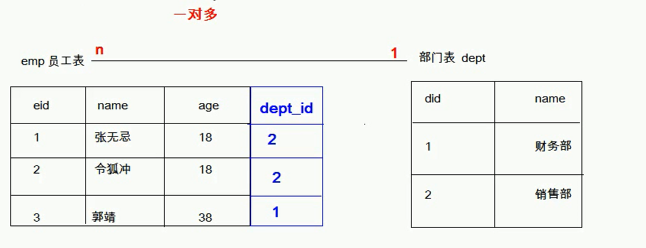  
       
    * **多对多的关系,需要中间表，中间表最少需要两个字段**
    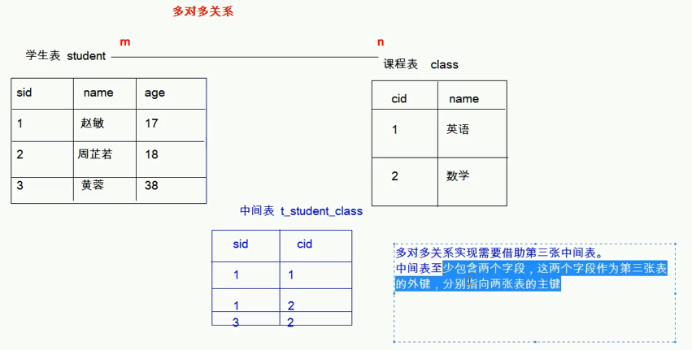  
    
    * **一对一的关系实现，学生表和身份证表，在任意一方添加唯一外键指向另外一方的主键**  
    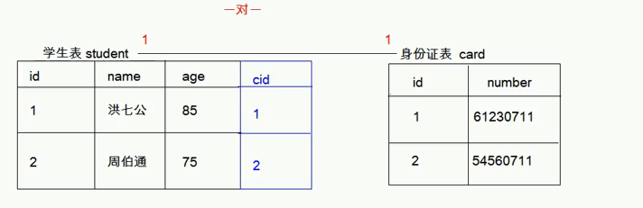  
    注意：需要让外键唯一，否则不符合一对一的前提 unique，
* 2.案例         

## 数据库的备份和还原   
1.命令行  
```sql
备份的语法:
mysqldump -u用户名 -p密码 数据库名称> 保存的路径及文件
还原的语法:
    1.登录数据库 
    2.创建数据库 
    3.使用数据库 
    4.还原数据库,执行文件 
```
  
2.图形化工具 
    
## 多表查询      
* 1.查询语句  
```sql
select * from  表名 

```
* 2.多表查询的分类 
    * 1.内连接查询:
        * 
        * 1.隐式内连接: 使用where条件来清除无用的条件 
            * ```sql
              
              ``` 
            * 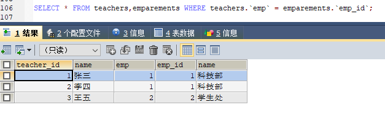
            
        * 2.显式内连接：
            * 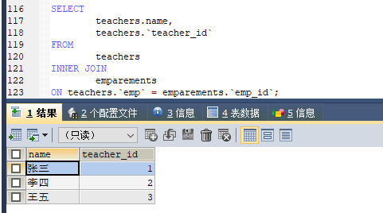
         
    * 2.外连接查询: 
        * 1.左外连接： 查询的是坐标所有的记录以及他们的交集  
        * 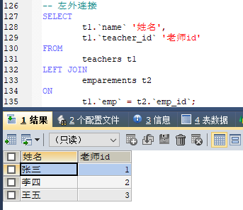
        * 2.右外连接: 
        * 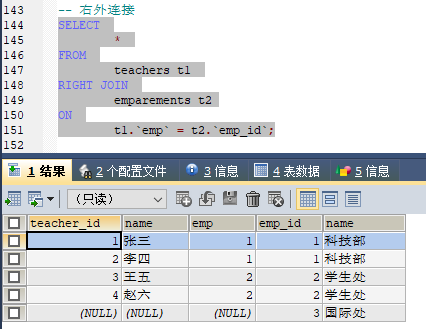
    * 3.子查询：
        * 概念： 在一个查询中嵌套另外一查询
        * 1.查询最高工资的员工信息 
        * ```sql
            select 
                     *
            from  
                  teacher 
            where    
                  teacher.id = (select max(id) from emparements);
          ``` 
          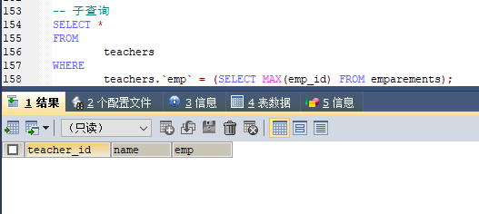
        * 2.子查询不同的情况 
            * 1.子查询的结果是单行单列的
                * 子查询可以作为条件，使用运算符来进行判断  
                1.查询工资小于平均工资人的信息 
                 ```sql
                    select *
                    from emp 
                    where emp.salary < (select avg(salary) from emp);
                 ```
            * 2.子查询的结果是多行单列的     
                * 1.可以使用in关键字 
                * 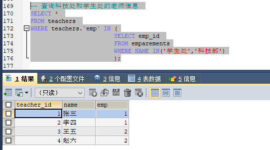
            * 3.子查询的结果是多行多列的    
                * 查询出来的结果可以当成一张虚拟表进行关联连接    
                * 1.查询员工入职日期在2011年11月11日之后的员工信息和部门信息  
                * 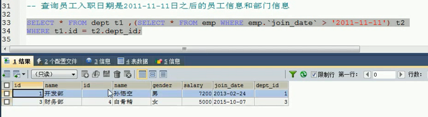
                
                
## 事务
###1.事务的基本介绍
* 1.概念： 如果一个包含多个步骤的业务操作，被事务管理，那么这些操作要么同时成功，要么同时失败 。
* 2.操作： 
    * 1.开启事务： start transaction
    * 2.回滚： rollback
    * 3.提交：commit

###2.事务的四大特征 
###3.事务的隔离级别 
## DCL  （DDL DQL DML） 四种语句 
    
