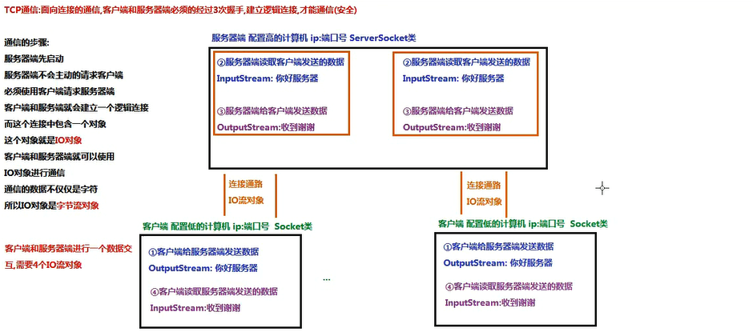

## TCP通信原理
Client和Server  
通信配置：  
1.服务器端程序需要事先启动，等待客户端的连接  
2.客户端主动连接服务器端，连接成功才可以通信，服务器端不主动连接客户端  

客户端和服务器端的通信是通过建立一个逻辑连接，而这个连接中包含一个IO对象，这个对象是字节流对象   
   
服务器端必须明确两件事情：  
1.多个客户端可以同时和服务器进行交互，服务器必须明确和哪个客户端进行交互，在服务器端accept可以获取到请求对的对象   
2.服务器同时和同个客户端进行交互，就需要使用多个io流对象，服务器是没有io流的，服务器可是获取到请求的客户端对象的Socket使用没客户端中的Socket中提供的IO流和客户进行交互   
服务器使用客户端的字节输入流读取客户端发送的数据  
服务器使用客户端字节输出流个客户端歇会对象  

